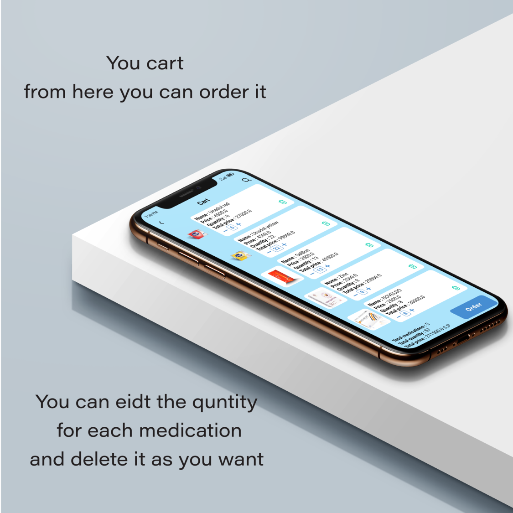

# Pharmageddon Application

Pharmageddon is a mobile application designed for pharmacies to streamline the process of browsing,
ordering, and tracking medications. The app offers features such as secure authentication, detailed
medicine information, order tracking, multi-language support, and Firebase notifications to enhance
user experience.

## Table of Contents

- [Features](#features)
- [App Preview](#app-preview)
- [Installation](#installation)
- [Usage](#usage)
- [Team Members](#team-members)
- [Contributing](#contributing)
- [License](#license)

## Features

- **Secure Authentication**: Login and registration with secure authentication.
- **Medicine Browsing**: Browse and search for medications with detailed descriptions and
  manufacturer information.
- **Order Management**: Add medications to your cart, adjust quantities, and place orders.
- **Order Tracking**: Track the status of your orders in real-time.
- **Multi Language Support**: Choose your preferred application language.
- **Firebase Notifications**: Receive real-time notifications about your orders and app updates.

## App Preview

### Authentication


Secure login and registration process for users.

### Medication - Manufacturer Browsing


Browse through medications and view manufacturer details and effects.

### Medication Details


Read all details, mark as favorite, select quantity, and add to cart.

### Cart Management


Manage your cart, edit quantities, and place orders.

### Order Tracking


Track the status of your orders in real-time.

### Order Details and Analytics


View detailed order information and analytics.

### Notifications - Profile


Receive real-time notifications from Firebase.

## Installation

1. **Clone the repository**:
    ```bash
    git clone https://github.com/Ahmad-Nour-Haidar/pharmageddon-mobile.git
    ```

2. **Navigate to the project directory**:
    ```bash
    cd pharmageddon-mobile
    ```

3. **Install dependencies**:
    ```bash
    flutter pub get
    ```

4. **Run the application**:
    ```bash
    flutter run
    ```

## Usage

1. **Register or Login**: Open the app and either log in with your existing account or create a new
   one.
2. **Browse Medications**: Explore the list of available medications, read detailed descriptions,
   and check manufacturer information.
3. **Manage Cart**: Add desired medications to your cart, adjust quantities, and proceed to order.
4. **Track Orders**: Monitor the status of your orders in real-time and receive notifications about
   updates.
5. **View Analytics**: Analyze your order history and details.

## Team Members

| S.No. | Team Member Name  | GitHub                                                     | Technology      |
|-------|-------------------|------------------------------------------------------------|-----------------|
| 1.    | Ahmad Nour Haidar | [@Ahmad-Nour-Haidar](https://github.com/Ahmad-Nour-Haidar) | Flutter Mobile  |
| 1.    | Ayman             | as                                                         | Flutter Mobile  |
| 2.    | Osama Saddik      | [@osamasaddik](https://github.com/osamasaddik)             | Laravel Backend |

## Contributing

We welcome contributions to enhance the Pharmageddon app. Here’s how you can help:

1. **Fork the repository**.
2. **Create a new branch**:
    ```bash
    git checkout -b feature-branch
    ```
3. **Make your changes and commit them**:
    ```bash
    git commit -m "Description of the feature"
    ```
4. **Push to the branch**:
    ```bash
    git push origin feature-branch
    ```
5. **Create a pull request**.

Please ensure your pull request adheres to the following guidelines:

- Describe the feature or fix in detail.
- Ensure the code follows the existing style and conventions.
- Include screenshots or demos of the new feature or fix if applicable.

## License

This project is licensed under the MIT License. See the [LICENSE](LICENSE) file for details.
